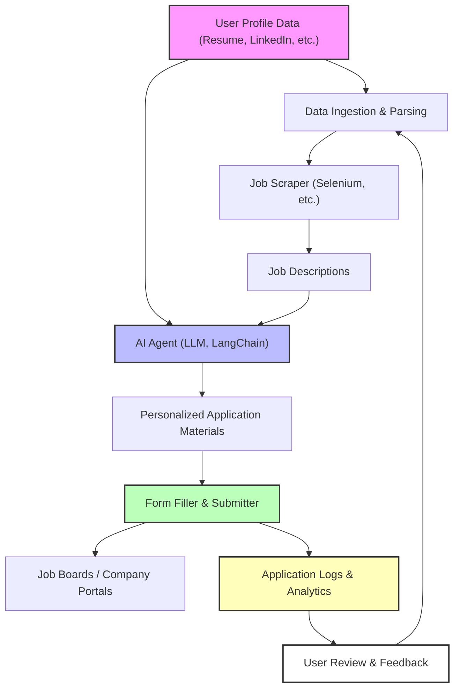

# 🏗️ SmartApply Architecture

## System Overview
SmartApply is designed as a modular, extensible automation engine for job applications, leveraging AI agents, robust data pipelines, and browser automation.

---

## 📊 High-Level Architecture Diagram

---

## 🧩 Components

### 1. Data Ingestion & Parsing
- **Purpose:** Load and parse user profile data (resume, LinkedIn, custom JSON/YAML).
- **Tech:** Python, Pydantic, custom parsers.
- **Extensibility:** Add new data formats by extending parser modules.

### 2. Job Scraper
- **Purpose:** Collect job descriptions from job boards/platforms.
- **Tech:** Selenium, BeautifulSoup, ChromeDriver.
- **Extensibility:** Add new job boards by implementing new scraping modules.

### 3. AI Agent (LLM, LangChain)
- **Purpose:** Analyze job descriptions and user profile, generate tailored application materials, score job fit.
- **Tech:** LangChain, Google Gemini, OpenAI APIs, custom prompt engineering.
- **Extensibility:** Swap or add LLM providers, update prompt logic, add new agent skills.

### 4. Form Filler & Submitter
- **Purpose:** Automate filling and submitting job application forms.
- **Tech:** Selenium, Pydantic (for form schema), custom logic for field mapping.
- **Extensibility:** Add support for new form types or platforms by extending form models.

### 5. Logging & Analytics
- **Purpose:** Track every application, log outcomes, and provide analytics for user review.
- **Tech:** JSON logs, custom analytics scripts, optional dashboard integration.
- **Extensibility:** Integrate with external analytics or dashboards.

---

## 🔄 Component Interactions
- Data flows from user profile ingestion → job scraping → AI agent matching → form filling → logging.
- Feedback loop: User reviews analytics, which can inform new data ingestion or agent tuning.

---

## 🚀 Extensibility & Scalability
- **Modular Design:** Each component is a separate module with clear interfaces.
- **Add New Boards/Formats:** Plug in new scrapers, parsers, or form handlers easily.
- **LLM Agnostic:** Swap or combine multiple LLMs/AI agents.
- **Scalable Automation:** Designed for batch processing and parallelization (future-proof for cloud/deployment).

---

## 🛡️ Technologies Used
- **Python 3.11+**
- **Selenium, BeautifulSoup** (scraping/automation)
- **LangChain, Google Gemini, OpenAI** (AI/LLM)
- **Pydantic** (data validation)
- **tqdm** (progress bars)
- **dotenv** (config management)

---

For more, see [README.md](README.md) and [FEATURES.md](FEATURES.md). 