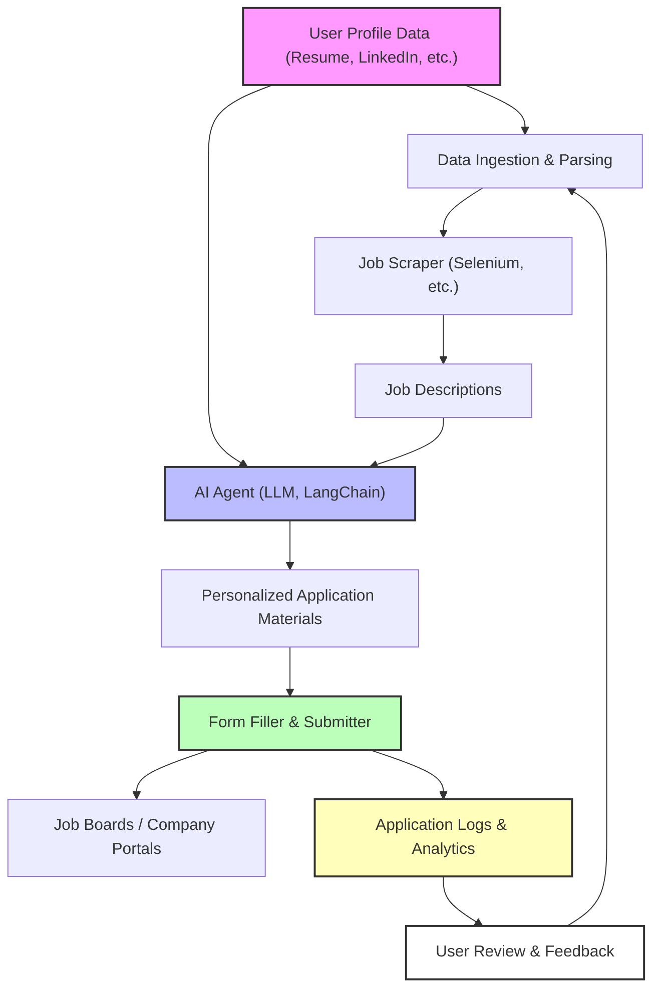

# 🚀 SmartApply: The Ultimate Automated Job Application Engine

[](https://www.python.org/downloads/)
[]()
[](https://www.langchain.com/)

<p align="center">
  <b>Tags:</b> <code>ETL</code> <code>AI Agent</code> <code>Automation</code> <code>Data Engineering</code> <code>CLI</code> <code>Job Search</code> <code>LLM</code> <code>Python</code>
</p>

---

## 🌐 Quick Links
- [Project Vision](PROJECT_VISION.md)
- [Architecture](ARCHITECTURE.md)
- [Features](FEATURES.md)
- [AI Agent Details](AI_AGENT.md)
- [Data Pipeline](DATA_PIPELINE.md)
- [Getting Started](#%EF%B8%8F-getting-started)
- [Screenshots / Demo](#%EF%B8%8F-screenshots--demo)

---

## 🏆 Project Overview

**SmartApply** is an AI-powered automation tool that revolutionizes the job application process. It leverages advanced AI agents, LLMs, and robust data pipelines to:
- Auto-fill hundreds of job applications in minutes.
- Intelligently match your resume to job descriptions.
- Tailor every application and cover letter for maximum impact.
- Integrate seamlessly with your data (resume, LinkedIn, custom profiles).
- Track, log, and analyze your application journey.

> **Problem Solved:** Manual job applications are time-consuming, repetitive, and often generic. SmartApply automates and personalizes this process, saving you 100+ hours and dramatically increasing your interview rate.

---

> ⚠️ **Caution:**  
> 
> This project is intended for educational purposes and is under active development. Additional enhancements are needed to ensure full compliance with LinkedIn and other job board policies.
> 
> Please carefully review each application before submitting to guarantee accuracy and adherence to job board requirements.

---

## ✨ Key Features
- ⚡ **Lightning Fast:** Apply to 100+ jobs in under 10 minutes.
- 🧠 **AI-Powered Personalization:** Every application is tailored to your skills, experience, and the job description using LLMs.
- 🔍 **Smart Matching:** Advanced NLP matches your profile to the best-fit roles.
- 🔌 **Plug-and-Play:** Connect your resume, LinkedIn, or custom data sources easily.
- 🏗️ **Modular & Extensible:** Add new job boards, resume formats, or AI models with minimal effort.
- 📊 **Transparent Tracking:** Logs every application for full visibility and analytics.
- 🛡️ **Secure & Private:** Your data stays local and under your control.

---

## 🏗️ Architecture

> **High-Level System Diagram:**



**Components:**
- **Data Ingestion:** Parses user profile data (resume, LinkedIn, etc.)
- **Job Scraper:** Collects job descriptions from boards/platforms (Selenium-based)
- **AI Agent:** Uses LLMs (LangChain, Gemini, etc.) for smart matching and content generation
- **Form Filler:** Automates form filling and submission
- **Logging & Analytics:** Tracks every application for review and improvement

> See [ARCHITECTURE.md](ARCHITECTURE.md) for a deep dive.

---

## ⚙️ How It Works
1. **Profile Ingestion:** Add your resume/LinkedIn data to `/src/data/`.
2. **Job Collection:** Scrape or import job listings from your target platforms.
3. **AI Matching:** LLMs analyze both your profile and job descriptions to generate tailored responses.
4. **Automated Application:** The system fills and submits applications at scale, handling complex workflows.
5. **Tracking:** Every application is logged for transparency and analytics.

---

## 🛠️ Getting Started

### Prerequisites
- Python 3.11+
- Chrome browser (for Selenium automation)
- [Google Gemini API Key](https://ai.google.dev/) (for LLM features)

### Setup
```bash
git clone https://github.com/yourusername/job-autoapply.git
cd job-autoapply
pip install -r requirements.txt
```

1. Add your resume/profile data to `src/data/`.
2. Set up your `.env` file with required credentials (see [ARCHITECTURE.md](ARCHITECTURE.md)).
3. Start the Chrome debugger:  
   `sh src/scripts/start_chrome_debugger.sh`
4. Run the main script:
   ```bash
   python src/scripts/main_collect.py   # Collect jobs
   python src/scripts/main_apply.py     # Auto-apply to jobs
   ```

---

## 🧑‍💻 Showcase: Skills & Expertise
- **Software Development:** Modular, testable Python code; robust error handling; logging; CI/CD ready.
- **AI Agent Development:** Prompt engineering, LLM orchestration (LangChain, Gemini), agent logic for form filling and scoring.
- **Data Engineering:** ETL pipelines for job and profile data; scalable scraping; structured data storage.
- **System Design:** Extensible, maintainable architecture; clear separation of concerns; scalable automation.

> For more, see [FEATURES.md](FEATURES.md), [AI_AGENT.md](AI_AGENT.md), [DATA_PIPELINE.md](DATA_PIPELINE.md).

---

## 🖼️ Screenshots / Demo

> _Coming soon!_

---

## 📄 Additional Documentation
- [PROJECT_VISION](PROJECT_VISION.md)
- [ARCHITECTURE.md](ARCHITECTURE.md)
- [FEATURES.md](FEATURES.md)
- [AI_AGENT.md](AI_AGENT.md)
- [DATA_PIPELINE.md](DATA_PIPELINE.md)

---

## ⚠️ Limitations & Issues
- Typeahead/combobox form inputs are not supported.
- Only "Easy Apply" job postings are supported for now.
- LinkedIn may block bots due to rate limits; some jobs may be skipped if pages do not load fully.

---

## 📬 Contact
- [LinkedIn: Piyush Upreti](https://www.linkedin.com/in/piyush-upreti/)
- Email: piyushupreti07@gmail.com

---

<p align="center"><b>Impress recruiters. Land more interviews. Automate your job search with SmartApply!</b></p> 
