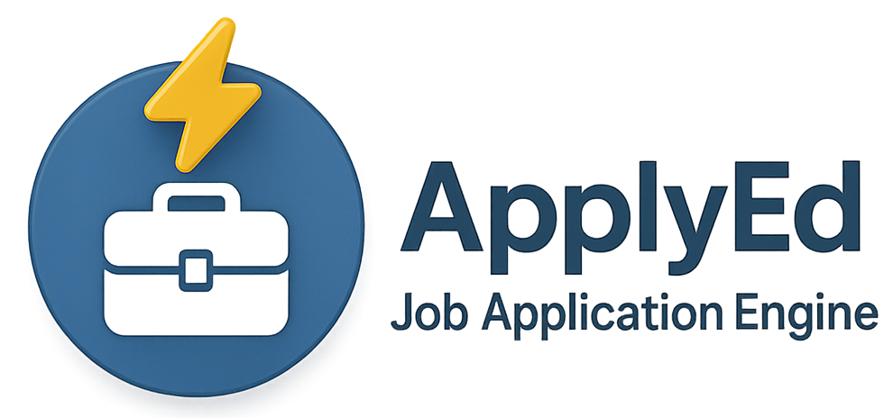
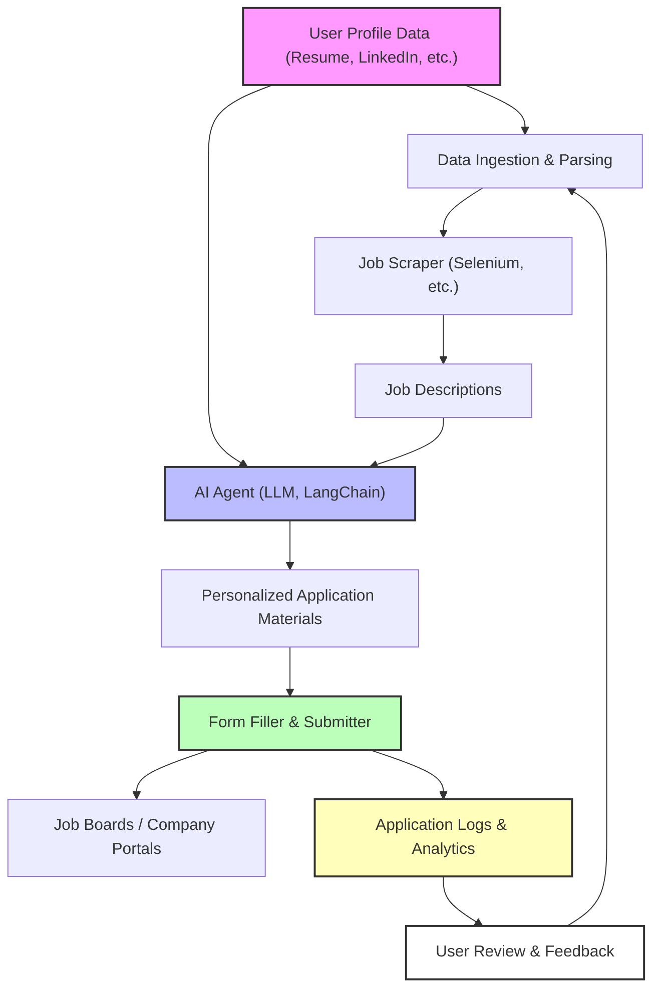

# ⚡️💼 AppyEd: Job Application Engine

<p align="center">
  
</p>

**ApplyEd** aims to leverage advanced AI agents that fully control the browser, learn your profile and preferences, and can intelligently answer any arbitrary question or field in application forms. All of this is achieved with a true **single-click solution**—no more tedious re-typing or partial automation.


[](https://www.python.org/downloads/)
[](LICENSE)
[]()
[](https://www.langchain.com/)
[](https://www.selenium.dev/)
[](https://ai.google.dev/)

<p align="center">
  <b>Tags:</b> <code>ETL</code> <code>AI Agent</code> <code>Automation</code> <code>Data Engineering</code> <code>CLI</code> <code>Job Search</code> <code>LLM</code> <code>Python</code>
</p>

<p align="center">
<a href="https://www.linkedin.com/in/piyush-upreti/"></a>
<a href="https://github.com/petrinax"></a>
<a href="https://mail.google.com/mail/?view=cm&fs=1&to=piyushupreti@gmail.com"></a>
</p>


## 🏆 Project Overview

**ApplyEd** is an AI-powered automation tool that revolutionizes the job application process by tackling the most frustrating pain points faced by job seekers:
- **Redundant, repetitive questions:** Job boards and company portals often require users to re-type the same information (work history, education, skills, etc.) across hundreds of forms.
- **Browser extension limitations:** Existing auto-fill tools and browser extensions frequently fail on complex or non-standard form fields, especially on platforms like LinkedIn's "Easy Apply".
- **Manual effort and errors:** Even with automation, users must review and correct fields, answer arbitrary questions, and adapt to ever-changing form formats.

> **Problem Solved:** Job application forms are filled with redundant, repetitive questions that force users to re-enter the same data over and over. Browser extensions and auto-fill tools often break on complex or dynamic fields, especially on LinkedIn. ApplyEd solves this by using AI agents that learn your profile, understand your preferences, and can answer any question in any application form—delivering a seamless, one-click application experience.


> ⚠️ **Caution:**  
> 
> This project is intended for educational purposes and is under active development. Additional enhancements are needed to ensure full compliance with LinkedIn and other job board policies.
> 
> Please carefully review each application before submitting to guarantee accuracy and adherence to job board requirements.

## 🌐 Quick Links
- [Project Vision](PROJECT_VISION.md)
- [Architecture](ARCHITECTURE.md)
- [Features](FEATURES.md)
- [AI Agent Details](AI_AGENT.md)
- [Data Pipeline](DATA_PIPELINE.md)
- [Getting Started](#%EF%B8%8F-getting-started)
- [Screenshots / Demo](#%EF%B8%8F-screenshots--demo)


## 🎯 Motivation

Job seekers waste countless hours re-entering the same information into job application forms across different platforms. Even the best browser extensions and auto-fill tools struggle with non-standard fields, dynamic forms, and arbitrary questions—especially on platforms like LinkedIn, where "Easy Apply" is often anything but easy. These tools are brittle, require constant user intervention, and fail to deliver a truly automated experience.

**ApplyEd** was created to break through these limitations. By harnessing the power of AI agents that can:
- Fully control the browser (not just fill fields, but interact as a human would)
- Learn and adapt to your unique profile, resume, and preferences
- Understand and answer any arbitrary question or custom field in real time
- Apply to jobs with a single click, regardless of the complexity or format of the application form

ApplyEd aims to make job applications as effortless as possible—no matter how many forms, questions, or platforms you face.


## ✨ Key Features
- ⚡ **Lightning Fast:** Apply to 100+ jobs in under 10 minutes.
- 🧠 **AI-Powered Personalization:** Every application is tailored to your skills, experience, and the job description using LLMs.
- 🤖 **True Browser Automation:** AI agents fully control the browser, navigating and interacting with any form, not just standard fields.
- 📝 **Handles Arbitrary Questions:** Can answer custom, open-ended, or non-standard questions in application forms—no more getting stuck on unexpected fields.
- 🔍 **Smart Matching:** Advanced NLP matches your profile to the best-fit roles.
- 🔌 **Plug-and-Play:** Connect your resume, LinkedIn, or custom data sources easily.
- 🏗️ **Modular & Extensible:** Add new job boards, resume formats, or AI models with minimal effort.
- 📊 **Transparent Tracking:** Logs every application for full visibility and analytics.
- 🛡️ **Secure & Private:** Your data stays local and under your control.


## 🏗️ Architecture

> **High-Level System Diagram:**



**Components:**
- **Data Ingestion:** Parses user profile data (resume, LinkedIn, etc.)
- **Job Scraper:** Collects job descriptions from boards/platforms (Selenium-based)
- **AI Agent:** Uses LLMs (LangChain, Gemini, etc.) for smart matching and content generation
- **Form Filler:** Automates form filling and submission
- **Logging & Analytics:** Tracks every application for review and improvement

> See [ARCHITECTURE.md](ARCHITECTURE.md) for a deep dive.


## ⚙️ How It Works
1. **Profile Ingestion:** Add your resume/LinkedIn data to `/src/data/`.
2. **Job Collection:** Scrape or import job listings from your target platforms.
3. **AI Matching:** LLMs analyze both your profile and job descriptions to generate tailored responses.
4. **Automated Application:** The system fills and submits applications at scale, handling complex workflows.
5. **Tracking:** Every application is logged for transparency and analytics.


## 🛠️ Getting Started

### Prerequisites
- Python 3.11+
- Chrome browser (for Selenium automation)
- [Google Gemini API Key](https://ai.google.dev/) (for LLM features)

### Setup
```bash
git clone https://github.com/yourusername/job-autoapply.git
cd job-autoapply
pip install -r requirements.txt
```

1. Add your resume/profile data to `src/data/`.
2. Set up your `.env` file with required credentials (see [ARCHITECTURE.md](ARCHITECTURE.md)).
3. Start the Chrome debugger:  
   `sh src/scripts/start_chrome_debugger.sh`
4. Run the main script:
   ```bash
   python src/scripts/main_collect.py   # Collect jobs
   python src/scripts/main_apply.py     # Auto-apply to jobs
   ```


## 🧑‍💻 Showcase: Skills & Expertise
- **Software Development:** Modular, testable Python code; robust error handling; logging; CI/CD ready.
- **AI Agent Development:** Prompt engineering, LLM orchestration (LangChain, Gemini), agent logic for form filling and scoring.
- **Data Engineering:** ETL pipelines for job and profile data; scalable scraping; structured data storage.
- **System Design:** Extensible, maintainable architecture; clear separation of concerns; scalable automation.

> For more, see [FEATURES.md](FEATURES.md), [AI_AGENT.md](AI_AGENT.md), [DATA_PIPELINE.md](DATA_PIPELINE.md).


## 🖼️ Screenshots / Demo

> _Coming soon!_


## 📄 Additional Documentation
- [PROJECT_VISION](PROJECT_VISION.md)
- [ARCHITECTURE.md](ARCHITECTURE.md)
- [FEATURES.md](FEATURES.md)
- [AI_AGENT.md](AI_AGENT.md)
- [DATA_PIPELINE.md](DATA_PIPELINE.md)
- [CONTRIBUTING.md](CONTRIBUTING.md)


## ⚠️ Limitations & Issues
- Typeahead/combobox form inputs are not supported.
- Only "Easy Apply" job postings are supported for now.
- LinkedIn may block bots due to rate limits; some jobs may be skipped if pages do not load fully.

---

<p align="center"><b>Impress recruiters. Land more interviews. Automate your job search with ApplyEd!</b></p> 
